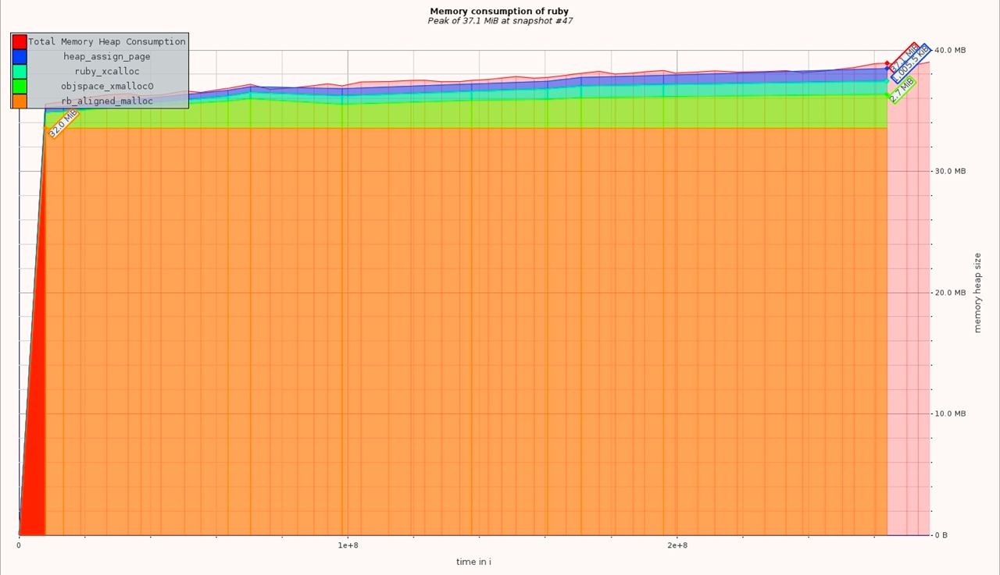

# Case-study оптимизации

## Актуальная проблема
В нашем проекте возникла серьёзная проблема.

Необходимо было обработать файл с данными, чуть больше ста мегабайт.

У нас уже была программа на `ruby`, которая умела делать нужную обработку.

Она успешно работала на файлах размером пару мегабайт, но для большого файла она работала слишком долго, и не было понятно, закончит ли она вообще работу за какое-то разумное время.

Я решил исправить эту проблему, оптимизировав эту программу.

## Формирование метрики
Для того, чтобы понимать, дают ли мои изменения положительный эффект на быстродействие программы я придумал использовать такую метрику: *тут ваша метрика*

## Гарантия корректности работы оптимизированной программы
Программа поставлялась с тестом. Выполнение этого теста в фидбек-лупе позволяет не допустить изменения логики программы при оптимизации.

## Feedback-Loop
Для того, чтобы иметь возможность быстро проверять гипотезы я выстроил эффективный `feedback-loop`, который позволил мне получать обратную связь по эффективности сделанных изменений за 12.3 секунды.

Вот как я построил `feedback_loop`: 
- профилируем метод `work`
- ищем главную точку роста
- оптимизировать ее
- проверить тестом
- замерить память
- закоммитить изменения

## Вникаем в детали системы, чтобы найти главные точки роста
Для того, чтобы найти "точки роста" для оптимизации я воспользовался:
- memory_profiler
- stackprof
- ruby_prof
- valgrind massif visualier

1. Для удобства сделал скрипт с разбивкой файла на нужное кол-ов строк
2. Сделал скрипт для `ruby-prof` который принимает переменные файл и метод для отчета
   `FILE=demo_data_10000.txt ruby benchmarks/ruby_prof.rb`

Вот какие проблемы удалось найти и решить

### Ваша находка №1
- отчеты `ruby-prof` показали главную точку роста в методе `#collect_stats_from_users` (отчет в режиме `flat` - `.split`)
- рефакторинг `#collect_stats_from_users` - вызов один раз
- было: 168 MB, стало 121 MB для 10_000 строк
- исправленная проблема перестала быть главной точкой роста

### Ваша находка №2
- отчет `stackprof` показал главную точку роста `String#split, Date.parse, String#upcase`
- рефакторинг, чтение файла построчно (оптимизация как в первой части)
- 121 MB -> 51 MB
- исправленная проблема перестала быть главной точкой роста

### Ваша находка №3
- отчет RubyProf показал главную точку роста `Array#each`, пришлось изменить версию ruby (в 3.0 не работает `ruby-prof` в режиме `MEMORY`)
- запись в файл построчно
- запустил тест с файлом 'data_large.txt' - MEMORY USAGE: 14 MB
- полностью укладываемся в бюджет

p.s. очень не нравится как сейчас выглядит код, можно отрефакторить, но считаю, что главное было справиться с задачей.

## Результаты
В результате проделанной оптимизации наконец удалось обработать файл с данными.
Удалось улучшить метрику системы со 168 мб (для 10000 строк) до 14 мб для всего файйла и уложиться в заданный бюджет.

## Защита от регрессии производительности
Для защиты от потери достигнутого прогресса при дальнейших изменениях программы был написан тест `bencmarks/memory_test.rb`.

## Checklist
- [x] Построить и проанализировать отчёт гемом `memory_profiler`
- [x] Построить и проанализировать отчёт `ruby-prof` в режиме `Flat`;
- [x] Построить и проанализировать отчёт `ruby-prof` в режиме `Graph`;
- [x] Построить и проанализировать отчёт `ruby-prof` в режиме `CallStack`;
- [x] Построить и проанализировать отчёт `ruby-prof` в режиме `CallTree` c визуализацией в `QCachegrind`;
- [x] Построить и проанализировать текстовый отчёт `stackprof`;
- [x] Построить и проанализировать отчёт `flamegraph` с помощью `stackprof` и визуализировать его в `speedscope.app`;
- [x] Построить график потребления памяти в `valgrind massif visualier` и включить скриншот в описание вашего `PR`;
- [x] Написать тест, на то что программа укладывается в бюджет по памяти

