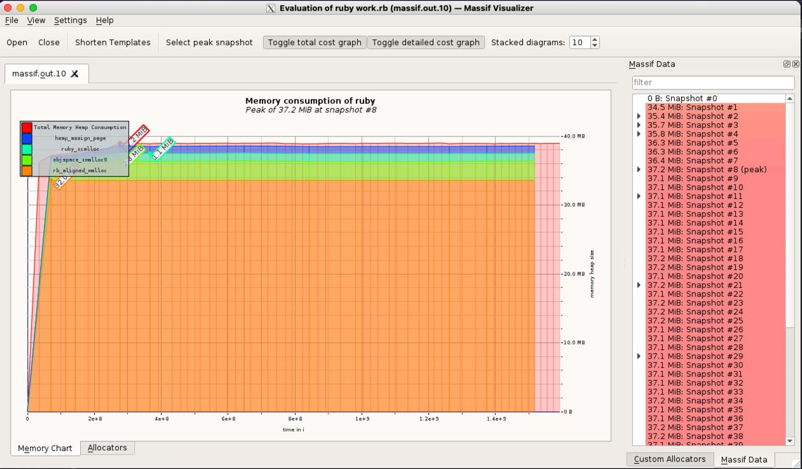

# Case-study оптимизации

## Актуальная проблема
В нашем проекте возникла серьёзная проблема.

Необходимо было обработать файл с данными, чуть больше ста мегабайт.

У нас уже была программа на `ruby`, которая умела делать нужную обработку.

Она успешно работала на файлах размером пару мегабайт, но для большого файла она работала слишком долго, и не было понятно, закончит ли она вообще работу за какое-то разумное время.

Я решил исправить эту проблему, оптимизировав эту программу.

## Формирование метрики
Для того, чтобы понимать, дают ли мои изменения положительный эффект на быстродействие программы я придумал использовать такую метрику:

Вывод объема затрачиваемой памяти с помощью
```ps -o rss= -p #{Process.pid}```

На файле 8 000 строк получилось 59 MB.

## Гарантия корректности работы оптимизированной программы
Программа поставлялась с тестом. Выполнение этого теста в фидбек-лупе позволяет не допустить изменения логики программы при оптимизации.

## Feedback-Loop
Для того, чтобы иметь возможность быстро проверять гипотезы я выстроил эффективный `feedback-loop`, который позволил мне получать обратную связь по эффективности сделанных изменений за 30-60 секунд

Вот как я построил `feedback_loop`:

Использую тот же общий фидбек луп как и в прошлом задании, который уже доказал свою эффективность :)

`while metrics < budget do`

- Профилирование
- Точка роста
- Изменения, направленные на оптимизацию главной точки роста
- Метрика
- Повторное рофилирование - понять как повлияло на точку роста
- Коммит

`end`

## Вникаем в детали системы, чтобы найти главные точки роста
Для того, чтобы найти "точки роста" для оптимизации я воспользовался ```memory_profiler```, ```stackprof (text)```, ```ruby_prof```

Вот какие проблемы удалось найти и решить

### Ваша находка №1 - пересоздание массива сессий

- ```memory_profiler```
- добавлять элементы в уже существующий массив с помощью метода ```<<```
- потребление уменьшилось с 59 до 43
- появилась новая точка роста

### Ваша находка №2 - отчёты по юзерам
```report['usersStats'][user_key] = report['usersStats'][user_key].merge(block.call(user))```

- ```stackprof``` в терминале
- Использование bang метода чуть-чуть улучшает ситуацию, но этого совсем не хватает, а в целом куча объектов размещается из-за вызовов ```collect_stats_from_users```. Встаёт вопрос о целесообразности рефакторить эти вызовы, если скрипт будем переписывать на потоковое чтение, поэтому сразу перейдём к нему.

### Ваша находка №3 - стриминг файлов
- точка роста та же
- переписать программу на потоковое чтение и запись файлов
- в конце программы при любом объёме файла потребляется 19 мб мемори
- новая точка роста ```String#split```

## Результаты
В результате проделанной оптимизации наконец удалось обработать файл с данными.
Удалось улучшить метрику системы с 59мб и бесконечного роста в зависимости от объёма файла до 20мб на любом объёме и уложиться в заданный бюджет.

Попробовал все инструменты профилирования. В том числе проверил через ```Valgrind```, разбуханий не обнаружил, пруфы имеются :)



## Защита от регрессии производительности
Для защиты от потери достигнутого прогресса при дальнейших изменениях программы написал тест с помощью матчера ```perform_allocation```, но не понял как точно он считает, потому что ```ps``` показывает 20мб, а ```perform_allocation``` 1.3мб.
