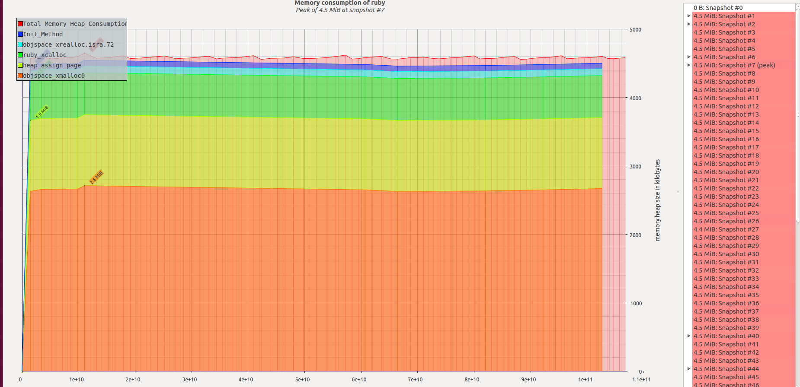

# Case-study оптимизации

## Актуальная проблема
В нашем проекте возникла серьёзная проблема.

Необходимо было обработать файл с данными, чуть больше ста мегабайт.

У нас уже была программа на `ruby`, которая умела делать нужную обработку.

Она успешно работала на файлах размером пару мегабайт, но для большого файла она работала слишком долго, и не было понятно, закончит ли она вообще работу за какое-то разумное время.

Я решил исправить эту проблему, оптимизировав эту программу.

## Формирование метрики
Для того, чтобы понимать, дают ли мои изменения положительный эффект на быстродействие программы я придумал использовать такую метрику:
 * объем используемой оперативной памяти при завершении работы программы
 * MEMORY USAGE (до оптимизации): 446 MB (на файле с 500_000 строками), 2529 MB (на исходном файле) 

## Гарантия корректности работы оптимизированной программы
Программа поставлялась с тестом. Выполнение этого теста в фидбек-лупе позволяет не допустить изменения логики программы при оптимизации.

## Feedback-Loop
Для того, чтобы иметь возможность быстро проверять гипотезы я выстроил эффективный `feedback-loop`, который позволил мне получать обратную связь по эффективности сделанных изменений за *время, которое у вас получилось*

Вот как я построил `feedback_loop`:
- запуск профилировщика
- анализ отчета профилировщика
- изменения в программе
- замер метрики
- запуск теста

## Вникаем в детали системы, чтобы найти главные точки роста
Для того, чтобы найти "точки роста" для оптимизации я воспользовался:
- memory_profiler
- ruby-prof
- stackprof

Вот какие проблемы удалось найти и решить

### Ваша находка №1
- какой отчёт показал главную точку роста
* memory_profiler
```
allocated memory by class
-----------------------------------
 265.83 MB  String
 173.22 MB  Array
 134.40 MB  Hash
  23.35 MB  MatchData
   8.62 MB  User
  72.00 kB  Date
allocated objects by class
-----------------------------------
   4855752  String
   1253637  Array
    808551  Hash
    139013  MatchData
     76933  User
      1000  Date
```
- как вы решили её оптимизировать
  * user_key заменил на интерполяцию
  * методы проеобразования строк заменил на bang методы
  * Убрал парсинг даты и кэширование результатов парсинга, т.к. даты в обрабатываемом файле и так в нужном формате. 
- как изменилась метрика
  * MEMORY USAGE: 436 MB
- как изменился отчёт профилировщика
```
allocated memory by class
-----------------------------------
 236.49 MB  String
 173.22 MB  Array
 134.23 MB  Hash
  23.35 MB  MatchData
   8.62 MB  User
allocated objects by class
-----------------------------------
   4122130  String
   1253637  Array
    807551  Hash
    139013  MatchData
     76933  User
```

### Ваша находка №2
- какой отчёт показал главную точку роста
- как вы решили её оптимизировать
  * написал программу в "потоковом" стиле - чтение исходного файла построчно, с записью в файл с результатами
  * использовал Set вместо Array для хранения всех браузеров
- как изменилась метрика
  * MEMORY USAGE: 19 MB (на файле с 500_000 строками), 19 MB (на исходном файле)
  * Общее время работы программы на исходном (полном) файле - 10.8948 сек
- как изменился отчёт профилировщика
```
allocated memory by class
-----------------------------------
 215.76 MB  String
 140.59 MB  Array
  84.01 MB  Hash
  23.35 MB  MatchData
  17.23 MB  JSON::Ext::Generator::State
   8.00 MB  User
 allocated objects by class
-----------------------------------
4199421  String
 868968  Array
 500002  Hash
 139013  MatchData
  76934  JSON::Ext::Generator::State
  76933  User
```
  * Все отчеты теперь показывают на String#split

### Ваша находка №3
- какой отчёт показал главную точку роста
  * ruby_prof
    * String#split (с этим ничего не поделать)
    * Object#parse_session
- как вы решили её оптимизировать
  * убрал метод
- как изменилась метрика
  * не изменилась, не значительно уменьшилось время обработки файла
- как изменился отчёт профилировщика
  * Object#parse_session из отчета ушел

## Результаты
В результате проделанной оптимизации наконец удалось обработать файл с данными.
Удалось улучшить метрику системы MEMORY USAGE с 2529 MB (2120 MB с выключенным прогрессбаром :)) до 19 MB и уложиться в заданный бюджет.



- попробовал в действии все профилировщики

## Защита от регрессии производительности
Для защиты от потери достигнутого прогресса при дальнейших изменениях программы `src/test_memory.rb`
