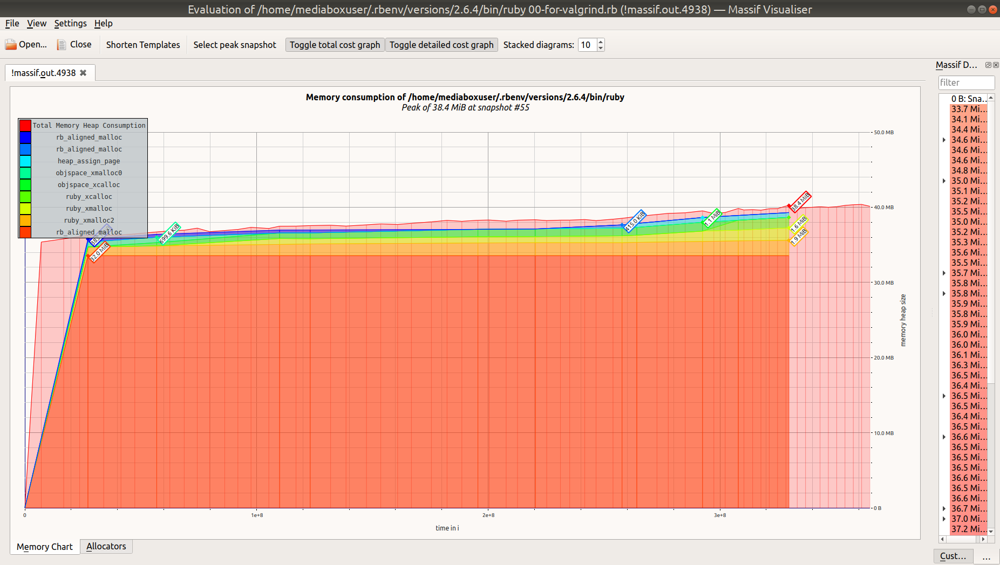
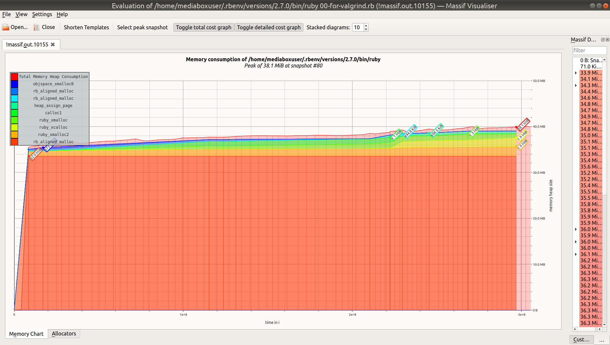

# Case-study оптимизации

## Актуальная проблема
В нашем проекте возникла серьёзная проблема.

Необходимо было обработать файл с данными, чуть больше ста мегабайт.

У нас уже была программа на `ruby`, которая умела делать нужную обработку.

После оптимизации программы обработка файла подобного размера стала занимать около 80 секунд. Впрочем, анализ памяти, занимаемой процессом до и сразу после выполнения программы (с помощью вывода команд `ps -o rss= -p #{Process.pid}`.to_i / 1024) показал, что в конце выполнения программа использует 1508 Мб памяти, что в нашем случае недопустимо. Была поставлена задача ограничить максимальное потребление памяти программой до 80 Мб (в том числе и в любой момент работы программы, а не только после её выполнения).

## Формирование метрики
Для того, чтобы понимать, дают ли мои изменения положительный эффект на быстродействие программы я использовал метрику, вычисляемую в описанном выше тесте -- разницу между потреблением памяти после и до начала работы программы.

## Гарантия корректности работы оптимизированной программы
Программа поставлялась с тестом. Выполнение этого теста в фидбек-лупе позволяет не допустить изменения логики программы при оптимизации.

## Feedback-Loop
Для того, чтобы иметь возможность быстро проверять гипотезы я выстроил эффективный `feedback-loop`, который позволил мне получать обратную связь по эффективности сделанных изменений -- после их внесения я тем же тестом замерял разницу в потребляемой памяти до и после выполнения программы. В случае попадания в бюджет нужно дополнительно проверить динамику использования памяти с помощью утилиты `valgrind`.

## Вникаем в детали системы, чтобы найти главные точки роста
Для того, чтобы найти "точки роста" для оптимизации я воспользовался `memory-profiler`, `valgrind`, `ruby-prof`, `stackprof`.

### Находка №1
- отчёт `memory-profiler` для полного файла получить не удалось -- система завершила процесс, как только общесистемное потребление памяти приблизилось к физически установленной (плюс объёму, выделенному под своп). Построил отчёт для файла на 100_000 строк. Больше половины аллокации памяти пришлось на метод `split` внутри итерации по всем строкам файла. Программу нужно переписать для построчных чтения/записи, чтобы не держать единомоментно в памяти большие объекты.
- как вы решили её оптимизировать -- переписал:)
- как изменилась метрика -- прирост памяти составил 2 Мб (вау). Проверил `valgrind`ом -- для `ruby-2.7.0` (с `jemalloc`) не создал `massif` файл с отчётом. Переключился на `ruby-2.6.4`, установленную также с `jemalloc` -- получил отчёт, по которому пиковая нагрузка составляет 38.4 Мб. Непонятны в связи с этим числом выводы, сделанные с помощью `ps -o rss= -p #{Process.pid}`. С учётом начального значения занятой памяти в предыдущих тестах, равного 25 Мб, и дополнительных 2 Мб -- 38 Мб никак не складываются. Пробовал перезапускать `valgrind` -- файл с отчётом опять перестал появляться. Запускал с разными версиями `ruby`, с `sudo` и без -- сделал вывод, что для успешного запуска необходимо находиться в глобальном гемсете, при попытке запуска из кастомных получал что-то вроде этого: `.../.rbenv/versions/2.7.0/lib/ruby/2.7.0/rubygems/core_ext/kernel_require.rb:92:in require': cannot load such file -- oj (LoadError)` (также про `pry` и `byebug`). Установил `rbenv` и из-под `root` пользователя, установил соотвествующие версии `ruby` и гемов -- не особо помогло. Получилось в итоге запустить `valgrind` c выдачей отчёта на `ruby-2.7.0` из-под обычного пользователя -- пиковое потребление памяти составило 38.1 Мб, что согласуется с показаниями для версии `2.6.4`. На этом доработку программы завершил, прогнав её остальными профилировщиками, упоминавшимся в вебинаре. 

## Результаты
В результате проделанной оптимизации наконец удалось обработать файл с данными. Удалось улучшить метрику системы с приращения потребляемой памяти в 1508 Мб до 2 Мб. Время работы программы составило около 130 секунд (на старом сервере).

Какими ещё результами можете поделиться -- `valgrind` работает нестабильно в плане выдачи файла с отчётом `massif` (`Debian 10`, `rbenv` свежеобновлённый неделю назад, `ruby-2.6.4` и `2.7.0`, установленные из-под него с `jemalloc`). В хотя бы примерно дело, понять не удалось, поиск в гугле тоже ни к чему не привёл. Проблема, к слову, возникала и на третьей машине с `Ubuntu 18.04` и тем же менеджером версий, потому, как мне казалось, интернет должен выдать что-то в ответ на мои запросы. `Memory-profiler` так и не удалось заставить работать с полным файлом, система останавливала процесс при достижении потребления памяти до физически доступного объёма. Утечка памяти при использовании профилировщика памяти. :)

## Защита от регрессии производительности
Для защиты от потери достигнутого прогресса при дальнейших изменениях программы написан тест на работу программы с файлом на 100_000 строк, при том, что увеличение потребляемой памяти не должно превышать 2 Мб.

## Checklist
- [+/-] Построить и проанализировать отчёт гемом `memory_profiler`
- [+] Построить и проанализировать отчёт `ruby-prof` в режиме `Flat`;
- [+] Построить и проанализировать отчёт `ruby-prof` в режиме `Graph`;
- [+] Построить и проанализировать отчёт `ruby-prof` в режиме `CallStack`;
- [+] Построить и проанализировать отчёт `ruby-prof` в режиме `CallTree` c визуализацией в `QCachegrind`;
- [+] Построить и проанализировать текстовый отчёт `stackprof`;
- [-] Построить и проанализировать отчёт `flamegraph` с помощью `stackprof` и визуализировать его в `speedscope.app`;
- [+/-] Построить график потребления памяти в `valgrind massif visualier` и включить скриншот в описание вашего `PR`;
- [+] Написать тест, на то что программа укладывается в бюджет по памяти

Отчёт valgrind для `ruby-2.6.4` c `jemalloc`:

Отчёт valgrind для `ruby-2.7.0` c `jemalloc`:

