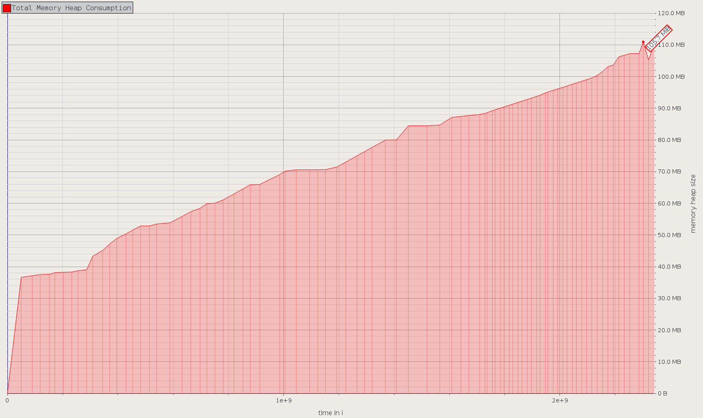

# Case-study оптимизации

## Актуальная проблема
В нашем проекте возникла серьёзная проблема.

Необходимо было обработать файл с данными, чуть больше ста мегабайт.

У нас уже была программа на `ruby`, которая умела делать нужную обработку.

После оптимизации по скорости она успешно обрабатывала файл в `130 MB` менее чем за `30 сек`, но при этом требовала около `3 GB` памяти для работы.

Я решил исправить эту проблему и продолжить оптимизировать эту программу с целью снизить объём потребляемой памяти. Конечно, существенная потеря производительности тоже недопустима.

## Метрика и Бюджет
Выбор метрики - это объем потребляемой памяти. Бюджет установим - `70 MB`

## Гарантия корректности работы оптимизированной программы
Программа поставлялась с тестом. Выполнение этого теста в фидбек-лупе позволяет не допустить изменения логики программы при оптимизации.

## Выстраиваем работу и Feedback-Loop

### Защита от регрессии производительности
Для защиты от регрессии производительности был написан `minitest` на проверку выделяемой памяти основным методом обработки `work`.
```ruby
class TestMe < Minitest::Test
  def memory_usage
    `ps -o rss= -p #{Process.pid}`.to_i / 1024
  end

  def test_result
    memory_usage_before= memory_usage
    work('tmp/data_80000.txt')
    memory_usage_after = memory_usage
    mem_usage = memory_usage_after - memory_usage_before
    puts "mem_usage: #{mem_usage} MB"
    assert_operator mem_usage, :<=, 90
  end
end
```
Для получения более точного значения этот тест лучше запускать отдельно, для чего очень удобно использовать `Makefile`.

### Вывод memory usage  
Для удобства добавим вывод информации о количестве используемой памяти при обработке основного файла:
```ruby
puts "MEMORY USAGE: #{`ps -o rss= -p #{Process.pid}`.to_i / 1024} MB"
```

### Пробуем профайлеры
При профилировании памяти важно **не отключать GC!!!**
Попробовал профилировать разными инструментами:

* `memory_profiler`
* `ruby-prof`
* `stackprof`
* `valgrind massif visualier`

На мой взгляд, `memory_profiler` - наиболее удобный инструмент для нашей задачи, который дает исчерпывающую информацию об аллокации памяти.
```ruby
# benchmark/memory_profiler.rb
report = MemoryProfiler.report do
  work('tmp/data_80000.txt', disable_gc: false)
end
report.pretty_print(scale_bytes: true)
```

Также удобно пользоваться отчетом `RubyProf::CallStackPrinter` в режиме `RubyProf.measure_mode = RubyProf::MEMORY`

```
# Makefile
memory_bench:
	ruby benchmark/memory_profiler.rb
	ruby benchmark/ruby-prof-memory.rb
```

Для того, чтобы убедиться, что программа на использует памяти больше заданного бюджета на протяжении всей работы будем использовать инструмент `valgrind massif visualier` (см `Dockerfile`, `build-docker.sh`, `profile.sh`, `visualize.sh`)
```
# Makefile
valgrind:
	./profile.sh && ./visualize.sh
```

**Рис 1.** Использование памяти в течение работы до оптимизации
