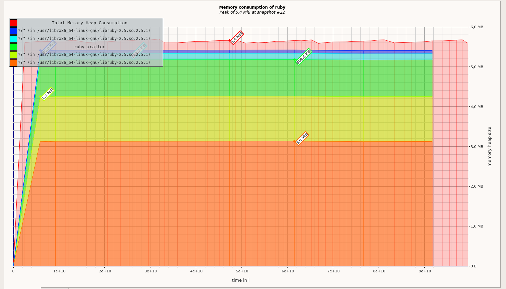

## Checklist
- [x] Построить и проанализировать отчёт гемом `memory_profiler`
- [x] Построить и проанализировать отчёт `ruby-prof` в режиме `Flat`;
- [x] Построить и проанализировать отчёт `ruby-prof` в режиме `Graph`;
- [x] Построить и проанализировать отчёт `ruby-prof` в режиме `CallStack`;
- [ ] Построить и проанализировать отчёт `ruby-prof` в режиме `CallTree` c визуализацией в `QCachegrind`;
- [ ] Построить и проанализировать текстовый отчёт `stackprof`;
- [x] Построить и проанализировать отчёт `flamegraph` с помощью `stackprof` и визуализировать его в `speedscope.app`;
- [x] Построить график потребления памяти в `valgrind massif visualier` и включить скриншот в описание вашего `PR`;
- [ ] Написать тест, на то что программа укладывается в бюджет по памяти

## Подготовка
Разнести все по отдельным файлам.
Подготовить инструменты:
- `benchmark`
- `memory_profiler`
- `ruby-prof` ( only Flat\Graph\CallStack)
- `valgrind massif visualier`   (  valgrind --tool=massif ruby task-2.rb  )
- Для профилирования выбран файл размером в **60 тыс.строк**

### Этап 1
1) Memory_profiler:  14.94 GB (2805658 objects) | метод  `file_lines.each`
2) Ruby_prof: 50.14% |  Object#collect_stats_from_users | each >> map >> Date

Решения:
- Парсить файл построчно (заменить += на <<)
- Оптимизировать парсинг Date
- Убрать двойной сплит при парсинге строк (+ убрать сохранение ненужных аргументов)

Что изменилось:
allocated memory   14,94 GB >>  4.21 GB
_______

### Этап 2 
1) Memory_profiler: #users.each 
2) Ruby_prof: 	Array#each 29.16 %

Решения:
- Добавил магическую строчку # frozen_string_literal: true
- не хранить юзеров как класс
- собирать сессии в накопительный хеш (= избавится от select)
- свести `collect_stats_from_users` в одно

Что изменилось:
 allocated memory   4.21 GB >> 84.77 MB

_______

### Этап 3
1) Memory_profiler: #split
2) Ruby_prof: 	#split 61.95 %

Решения:
- Кардинально поменять подход к хранению. Т.к. за каждым юзером идут только его сессии, то можно парсить их совместно и
сразу сохранять в файл, тем самым не тратя память на хранение. 
- Убрал накопители для сессий
- Убрал лишние аттрибуты для юзера и сессий ( ИД, номер и т.д.)

Что изменилось:
- упал расход памяти кардинально ~ 40 Мб
- время обработки файла составило всего 6,5 сек. с включенным GC (в первом задании было 22,5 сек)! (MEMORY USAGE: 29 MB)

