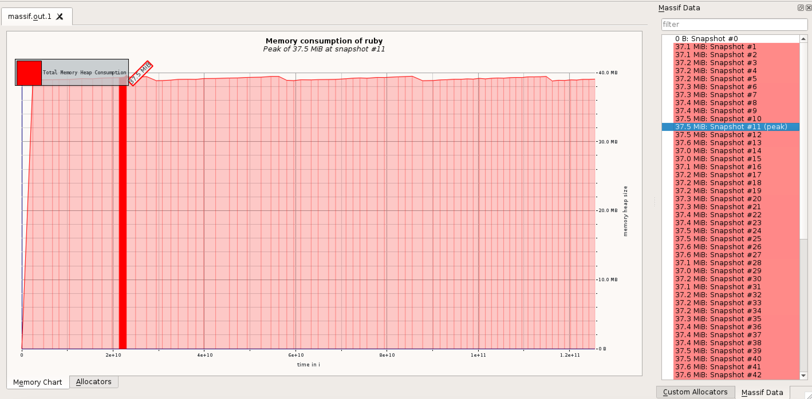

# Case-study оптимизации

## Актуальная проблема
В нашем проекте возникла серьёзная проблема.

Необходимо было обработать файл с данными, чуть больше ста мегабайт.

У нас уже была программа на `ruby`, которая умела делать нужную обработку.

Она успешно работала на файлах размером пару мегабайт, но для большого файла она работала слишком долго, и не было понятно, закончит ли она вообще работу за какое-то разумное время.

Я решил исправить эту проблему, оптимизировав эту программу.

## Формирование метрики
Для того, чтобы понимать, дают ли мои изменения положительный эффект на быстродействие программы я придумал использовать такую метрику: *размер потребляемой памяти при обработке файла в 16 000 строк*

## Гарантия корректности работы оптимизированной программы
Программа поставлялась с тестом. Выполнение этого теста в фидбек-лупе позволяет не допустить изменения логики программы при оптимизации.

## Feedback-Loop
Для того, чтобы иметь возможность быстро проверять гипотезы я выстроил эффективный `feedback-loop`, который позволил мне получать обратную связь по эффективности сделанных изменений за *~60 cек*

Вот как я построил `feedback_loop`:
- выбор точки роста на основании данных `memory-profiler`, секции "allocated memory by gem", "allocated memory by file", и 6 строк из секции "allocated memory by location"; GC отключен
- рефакторинг кода
- смотрю успешность прохождения unit-теста и данные профайлера
- защита метрики
## Вникаем в детали системы, чтобы найти главные точки роста
Для того, чтобы найти "точки роста" для оптимизации я воспользовался:
- `rss` мониторинг объема оперативной памияти для процесса процессу
- `memory_profiler` report
- `ruby-prof` + QCachegrind MEMORY profiling
- `ruby-prof` + ALLOCATIONS profiling в форматах flat, graph и callstack
- `valgrind` + `massif-visualizer`
- `stackprof` в режиме :object с репортом в формате flamegraph

Вот какие проблемы удалось найти и решить:

## Подготовка
- настроил автоматический запуск unit-теста для #work с помощью `Guard`
- переписал #work в "потоковом" стиле
- запустил профайлеры из списка, выбрал наиболее информативный
- запустил профилирофщик `memory-profiler` взял из QCachegrind значение 21.74 MB
- добавил спек для фиксации метрики `rspec-benchmark` с пороговым значением 21.74 MB
- настроил автоматический запуск профилировщика `memory-profiler` на файле данных размером 16 000 строк с помощью `Guard`

### Ваша находка №1
- `memory-profiler` показал главную точку роста `sessions.map { |s| Date.strptime(s.date, '%Y-%m-%d') }.sort.reverse.map(&:iso8601)`
- решил убрать форматирование дат так-как все даты в исходном файле имеют нужный формат
- allocated memory меньше на 3.99 MB: 21.74 MB -> 17.75 MB, RSS MEMORY USAGE: 29 MB
- исправленная проблема перестала быть главной точкой роста но фактический размер используемой памяти при обработке файла 'data_large.txt' не изменился. Принял решение завершить оптимизацию, поскольку память укладываются в бюджет.

## Завершение
- добавил спек для фиксации метрики `rspec-benchmark` с пороговым значением 17.75 MB
- построил график потребления памяти в `valgrind massif visualier`

## Результаты
В результате проделанной оптимизации наконец удалось обработать файл с данными.
Удалось улучшить метрику системы с *RSS MEMORY USAGE: 301 MB, до того, 29 MB* и уложиться в заданный бюджет. Вместе с этим  количество итераций в секунду при обработке файла в 16 000 строк выросла в 40 раз.
По данным valgrind massif, на обработку всего файла data_large.txt расходуется около 37.7 MB памяти без значительных всплесков.

## Защита от регрессии производительности
Для защиты от потери достигнутого прогресса при дальнейших изменениях программы *о performance-тестах, которые вы написали*
