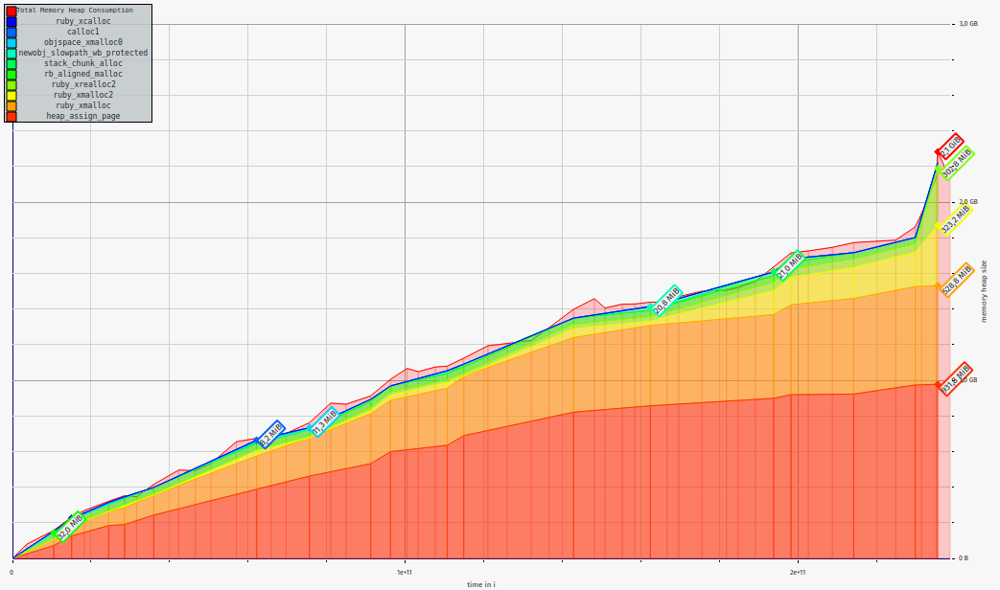
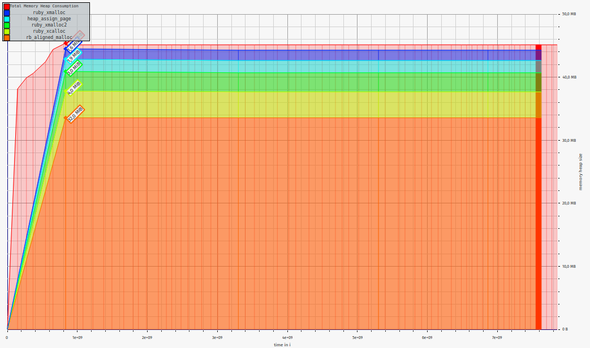

# Задание 2. Case Study.

## Checklist
- [x] Построить и проанализировать отчёт гемом `memory_profiler`
- [x] Построить и проанализировать отчёт `ruby-prof` в режиме `Flat`;
- [x] Построить и проанализировать отчёт `ruby-prof` в режиме `Graph`;
- [x] Построить и проанализировать отчёт `ruby-prof` в режиме `CallStack`;
- [x] Построить и проанализировать отчёт `ruby-prof` в режиме `CallTree` c визуализацией в `QCachegrind`;
- [x] Построить и проанализировать текстовый отчёт `stackprof`;
- [x] Построить и проанализировать отчёт `flamegraph` с помощью `stackprof` и визуализировать его в `speedscope.app`;
- [x] Построить график потребления памяти в `valgrind massif visualier` и включить скриншот в описание вашего `PR`;
- [x] Написать тест, на то что программа укладывается в бюджет по памяти

## Начальные метрики в полном файле
* Время выполнения: **21 сек.** 
* Память: **2296 Мб**
* График Massif Visualizer:
  

## Feedback Loop

В начале будем использовать лимит во 20 000 строк.


### Итерация 1
#### какой отчёт показал главную точку роста
memory_profiler показал 1.68 Гб массивов и большое выделение объектов в `File.read ... .split`:
```
allocated memory by class
-----------------------------------
   1.68 GB  Array

allocated objects by location
-----------------------------------
   3250943  /home/dave/dev/rails-optimization-task2/src/work.rb:43
   
```
#### как вы решили её оптимизировать
Перейти к построчному чтению файла.
#### как изменилась метрика
`492 MB` => `110 MB`
#### как изменился отчёт профилировщика
Потребление перенеслось в другую строку, теперь это наполнение массива `sessions`. Однако, массивов все еще много:
```
allocated objects by location
-----------------------------------
    221432  /home/dave/dev/rails-optimization-task2/src/work.rb:138

 => { 'dates' => user.sessions.map{|s| s['date']}.map {|d| Date.parse(d)}.sort.reverse.map { |d| d.iso8601 } }

allocated memory by class
-----------------------------------
   1.65 GB  Array
```


### Итерация 2
#### какой отчёт показал главную точку роста
Call Tree ruby-prof показывает много аллокаций в `map` и `Date#parse` 
```
100.00% (100.00%) Object#ruby_prof [1 calls, 1 total]
  100.00% (100.00%) Object#do_work [1 calls, 1 total]
    100.00% (100.00%) Object#work [1 calls, 1 total]
53.01% (53.01%) Object#collect_stats_from_users [7 calls, 7 total]
      53.01% (100.00%) Array#each [7 calls, 9 total]
        30.87% (58.23%) Array#map [33506 calls, 33508 total]
          22.67% (73.45%) <Class::Date>#parse [16954 calls, 16954 total]
          
 => { 'dates' => user.sessions.map{|s| s['date']}.map {|d| Date.parse(d)}.sort.reverse.map { |d| d.iso8601 } }
```
#### как вы решили её оптимизировать
Как уже было понятно, парсинг дат тут не нужен, даты изначально в ISO 8601. Избавляемся от парсинга дат и последовательных вызовов `#map`.
#### как изменилась метрика
`110 MB` => `108 MB`. 
#### как изменился отчёт профилировщика
Несмотря на то, что потребление памяти изменилось незначительно, проблема ушла из отчета. 
```
100.00% (100.00%) Object#work [1 calls, 1 total]
  58.31% (58.31%) Enumerator#with_index [1 calls, 1 total]
    58.31% (100.00%) IO#each_line [1 calls, 2 total]
      22.56% (38.70%) String#split [20000 calls, 40000 total]
      22.35% (38.32%) Object#parse_session [16954 calls, 16954 total]
        19.55% (87.50%) String#split [16954 calls, 40000 total]
      3.51% (6.02%) Object#parse_user [3046 calls, 3046 total]
```
Будем теперь смотреть потребление памяти, а не аллокации.


### Итерация 3
#### какой отчёт показал главную точку роста
ruby_prof, callgrind. Видно потребение при вызове `#split` при чтении файла. 
#### как вы решили её оптимизировать
По коду видно, что этот вызов нужен только для того, чтобы определить тип записи -- пользователь или сессия. Но это можно определять просто по первому символу всей строки.

Заодно заменим явно неоптимальное заполенение массивов через `+` и ненужное создание переменных в методах `parse_*`. Подтверждая эффективность метрикой.
#### как изменилась метрика
`108 MB` => `84 MB`.
#### как изменился отчёт профилировщика
`#split` ушел из топа. Теперь там видны вызовы `#each` в методе `collect_stats_from_user`.


### Итерация 4
#### какой отчёт показал главную точку роста
ruby_prof, callgrind. Видно потребение при вызовх `#each` в методе `collect_stats_from_user`.
#### как вы решили её оптимизировать
Будем рефакторить сами подсчеты всего через этот метод. Вынесем его в метод вместе с рефакторингом чтения файла и наполнения коллекции объектов пользователей, сделанным аналогично тому, как было при оптимизации производительности. Будем наполнять отчет по пользователям не сохраняя массива сессий.
#### как изменилась метрика
`84 MB` => `36 MB`.
#### как изменился отчёт профилировщика
Этой проблемы больше не видно. Однако, стало очень заметно потребление на вызовах `#split`, при парсинге как сессий, так и пользователей.


### Итерация 5
#### какой отчёт показал главную точку роста
Так как потребление и скорость сильно уменьшились, для исключения влияния постоянной составляюшей увеличим выборку в 10 раз.

В этот раз буду использовать memory_profiler (но по факту ruby-prof согласен с ним).

В отчере видно большое выделение памяти при выполнении `fields = session.split(',')`:
```
allocated memory by location
-----------------------------------
   7.46 MB  /home/dave/dev/rails-optimization-task2/src/work.rb:19

```
#### как вы решили её оптимизировать
Парсинг сессий и пользователей переведен со `#split` на разбор через регулярку через `String#[]` (не создает массив вхождений). Попутно получилось избывиться от хеш-представления сессий. Далее, для того, чтобы не требовалось хранить сессии в виде хешей, был изменен алгоритм подсчета результирующих полей отчета на использование аккумулирующих значений при обходе сессий, без их сохранения. Также при этом рефакторинге был убран массив объектов пользователей.
#### как изменилась метрика
`158 MB` => `73 MB`.
#### как изменился отчёт профилировщика
Проблемы со `#split` больше нет, однако, разбор строки через `#[]` тоже потребляет существенную память.


### Итерация 6
#### какой отчёт показал главную точку роста
По отчетам не наблюдается какой-то явно оптимизируемой точки, поэтому пора переосмыслить алгоритм.
#### как вы решили её оптимизировать
Будем писать результат в файл "на лету", избегая, таким образом создания структуры отчета в памяти вообще.
#### как изменилась метрика
`73 MB` => `22 MB`.

**Пробуем читать весь файл -- тоже 22 Мб. Бюджет достигнут.**
#### как изменился отчёт профилировщика
Видно много работы со строками и чуть-чуть `#to_json`. Теоретически, можно еще поиграть с разделением строк через запятую и сделать свой быстрый to_json, но бюджет достигнут.

## Конечные метрики в полном файле
* Время выполнения: **16 сек.**
* Память: **22 Мб**
* График Massif Visualizer:
  
